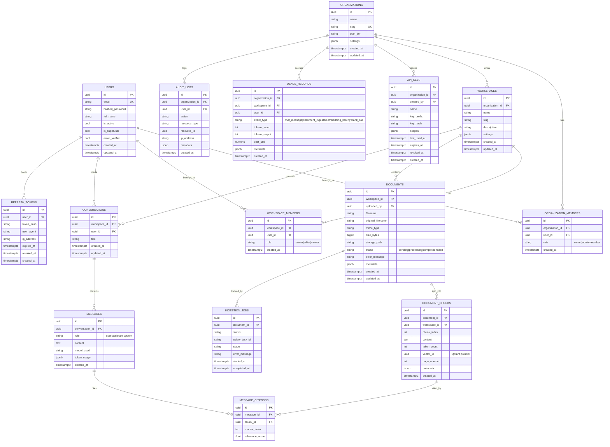

# Database Design

PostgreSQL 16 holds all relational/metadata state. Qdrant holds vector embeddings only (payload-linked back to `document_chunks.id`). Redis holds ephemeral state (cache, rate-limit counters, Celery queues) — nothing here is a system of record.

## Entity-relationship diagram



## Design notes

- **Primary keys**: UUID v4 everywhere (`uuid_generate_v4()` / app-side `uuid4()`), so IDs are safe to expose in URLs and never leak sequential-ID information about tenant size.
- **Multi-tenancy**: `organizations` is the billing/tenant root. `workspaces` is the unit documents/conversations/search are scoped to (an org can run multiple isolated knowledge bases — e.g. per team or per client). Every downstream table carries `workspace_id` for direct, index-friendly filtering rather than requiring a join through `organizations` on every query.
- **Soft revocation, not deletion**: `refresh_tokens.revoked_at`, `api_keys.revoked_at` — tokens are never hard-deleted so audit trails survive revocation.
- **`document_chunks.vector_id`**: the join key to Qdrant. The chunk's text and metadata live in Postgres (cheap to query/paginate/join for citations); only the embedding vector lives in Qdrant. This avoids ever needing to round-trip Qdrant to render a citation or re-chunk a document.
- **`message_citations`** is a normalized join table (not a JSON blob on `messages`) so citation relevance scores and chunk references are queryable — e.g. "which chunks are cited most often" for analytics.
- **`ingestion_jobs`** is separate from `documents.status` so a document can be re-ingested (new job row) without losing history of prior attempts.
- **Indexes** (created in the first Alembic migration): `workspace_id` on every scoped table, `(email)` unique on `users`, `(organization_id, slug)` unique on `workspaces`, `(conversation_id, created_at)` on `messages` for ordered history fetch, `(key_prefix)` on `api_keys` for fast lookup before hash comparison.
- **JSONB columns** (`settings`, `metadata`, `scopes`, `token_usage`) hold provider-specific or evolving-shape data that doesn't warrant its own migration for every new field (e.g. per-document parser metadata, per-plan feature flags).
- **Row-level tenant isolation** is enforced in the service layer (every repository method takes and filters by `workspace_id`/`organization_id`, and every endpoint re-verifies the path's `workspace_id` against the resolved row rather than trusting existence alone — see `docs/ARCHITECTURE.md` §5). The Phase 9 security review re-audited every list/get/delete endpoint against this pattern and found (and fixed) one gap outside this table's scope — see `docs/PROGRESS.md`. Postgres RLS policies as an additional defense-in-depth layer remain a deliberately deferred hardening item, not implemented in this build.
- **`api_keys` is schema-only** — the table and model exist (for a future programmatic-access feature), but no service or endpoint creates, authenticates, or revokes them yet. Nothing in the running application reads or writes this table today.

## Qdrant collection schema

Single collection `document_chunks` (configurable name), vector size matching the embedding provider's output dimension (1024 for `voyage-3-large`), cosine distance.

Payload per point:

```json
{
  "chunk_id": "uuid — FK back to document_chunks.id",
  "document_id": "uuid",
  "workspace_id": "uuid",
  "organization_id": "uuid"
}
```

`workspace_id` is a payload index (`keyword`) so every search request applies a `must: [{ key: "workspace_id", match: { value: ... } }]` filter — this is the tenant-isolation boundary for vector search.
