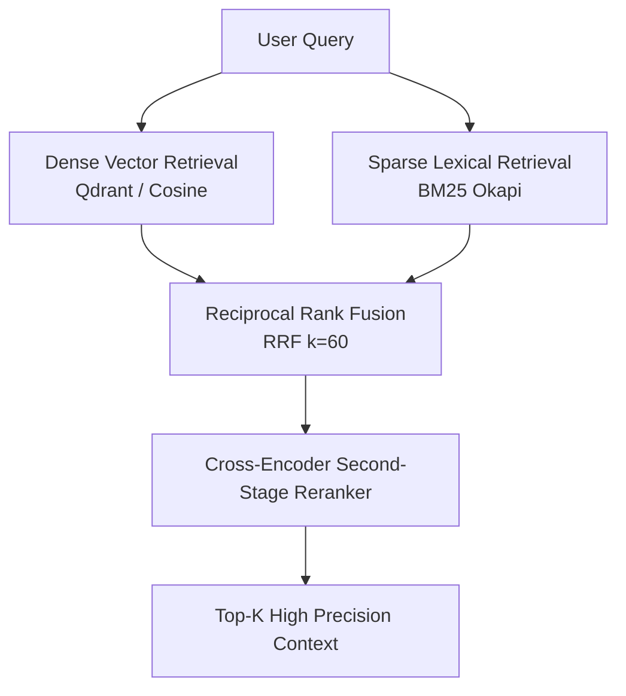

# Quantitative Retrieval & Reranking Evaluation

RAG-Forge includes a quantitative evaluation framework for measuring and comparing information retrieval (IR) performance across **Dense (Vector)**, **Sparse (BM25)**, **Hybrid (Reciprocal Rank Fusion)**, and **Cross-Encoder Reranked** architectures.

---

## 1. Evaluation Methodology

A reliable RAG pipeline must retrieve the most relevant passages at the highest possible ranks before feeding context to an LLM generator. RAG-Forge evaluates retrieval strategies using standard, reproducible information retrieval metrics:

| Metric | Formula / Definition | Objective |
| :--- | :--- | :--- |
| **NDCG@K** | $\text{NDCG}@K = \frac{\text{DCG}@K}{\text{IDCG}@K} = \frac{\sum_{i=1}^K \frac{2^{rel_i} - 1}{\log_2(i+1)}}{\text{Ideal DCG}@K}$ | Measures graded relevance accounting for position discount. |
| **Recall@K** | $\frac{|\text{Retrieved}_K \cap \text{Relevant}|}{|\text{Relevant}|}$ | Measures fraction of all relevant documents captured in top-$K$. |
| **Precision@K** | $\frac{|\text{Retrieved}_K \cap \text{Relevant}|}{K}$ | Measures density of relevant passages in top-$K$. |
| **MRR@K** | $\frac{1}{\text{Rank of first relevant item}}$ | Measures how quickly the first relevant passage is returned. |
| **Hit Rate@K** | $\mathbb{I}(|\text{Retrieved}_K \cap \text{Relevant}| > 0)$ | Binary success rate at cutoff $K$. |

---

## 2. Multi-Domain Benchmark Dataset

The evaluation suite includes a curated multi-domain benchmark covering challenging enterprise RAG domains:

- **Distributed Systems**: Consensus algorithms (Raft vs Paxos), vector clocks, consistent hashing, two-phase locking.
- **Financial Regulations**: ASC 606 / IFRS 15 revenue recognition 5-step model, Adjusted EBITDA reconciliations, capitalized software development costs.
- **Regulatory Compliance**: SOC 2 Type II controls, GDPR Article 17 (Right to Erasure), Zero Trust Network Architecture (ZTNA), AES-256-GCM authenticated encryption.
- **Clinical Guidelines**: AHA/ACC hypertension pharmacotherapy, Surviving Sepsis 1-hour resuscitation bundle, ADA diabetes glycemic targets.

---

## 3. Compared Retrieval Architectures



1. **Dense Semantic Retrieval**: Embeds query and documents into semantic vector space; retrieves nearest neighbors using cosine similarity.
2. **Sparse Lexical Retrieval (BM25 Okapi)**: Token-level term frequency and inverse document frequency scoring with length normalization ($k_1=1.5, b=0.75$).
3. **Hybrid RRF (Reciprocal Rank Fusion)**: Rank-based fusion combining dense and sparse candidate rankings:
   $$\text{RRF Score}(d) = \sum_{m \in \{\text{dense}, \text{sparse}\}} \frac{1}{k + r_m(d)}$$
4. **Hybrid + Cross-Encoder Reranker**: Two-stage pipeline where hybrid retrieval gathers candidates (e.g., top 50), and a cross-encoder scores deep query-document interactions.

---

## 4. Running the Evaluation Harness

### Execute CLI Evaluation Report
```bash
python scripts/run_retrieval_eval.py
```

### Run Unit Tests
```bash
python -m unittest tests/unit/test_retrieval_evaluation.py
```

All metrics and benchmark evaluations execute deterministically with 0 external API dependencies.
